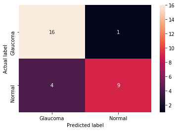
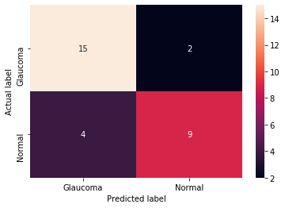
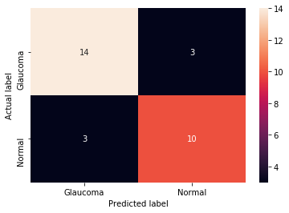
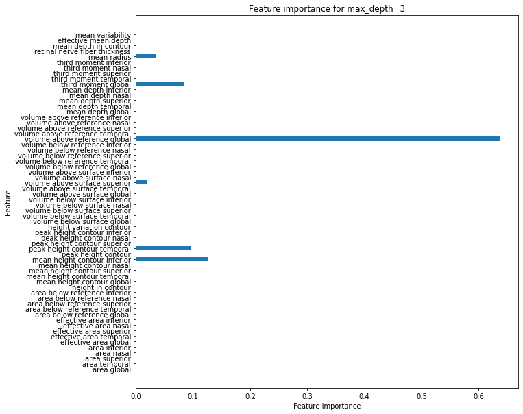

<!--
*** Thanks for checking out the Best-README-Template. If you have a suggestion
*** that would make this better, please fork the repo and create a pull request
*** or simply open an issue with the tag "enhancement".
*** Thanks again! Now go create something AMAZING! :D
-->


<!-- PROJECT SHIELDS -->
<!--
*** I'm using markdown "reference style" links for readability.
*** Reference links are enclosed in brackets [ ] instead of parentheses ( ).
*** See the bottom of this document for the declaration of the reference variables
*** for contributors-url, forks-url, etc. This is an optional, concise syntax you may use.
*** https://www.markdownguide.org/basic-syntax/#reference-style-links
-->
[![Contributors][contributors-shield]][contributors-url]
[![Forks][forks-shield]][forks-url]
[![Stargazers][stars-shield]][stars-url]
[![MIT License][license-shield]][license-url]
[![LinkedIn][linkedin-shield]][linkedin-url]


<!-- PROJECT LOGO -->
<br />
<p align="center">
  <a href="https://github.com/smashfu/practice">
    
  </a>

  <h1 align="center">Glaucoma Detection Using Machine Learning and Deep Learning methods</h1>

  <p align="center">
    A short report of our experiments.
    <br />
    <a href="https://github.com/mirtanvirislam/Glaucoma-Detection-with-ML-NN"><strong>Read the full published conference paper»</strong></a>
    <br />
    <br />
 <!-- <a href="https://github.com/othneildrew/Best-README-Template">View Demo</a>
    ·
    <a href="https://github.com/othneildrew/Best-README-Template/issues">Report Bug</a>
    ·
    <a href="https://github.com/othneildrew/Best-README-Template/issues">Request Feature</a> -->
  </p>
</p>


<!-- TABLE OF CONTENTS -->
<details open="open">
  <summary>Table of Contents</summary>
  <ol>
    <li>
      <a href="#about-the-project">About The Project</a>
      <ul>
        <li><a href="#software-components">Software Components</a></li>
      </ul>
    </li>
    <li><a href="#dataset">Dataset</a></li>
    <li>
      <a href="#machine-learning-algorithms-and-their-results">Machine learning algorithms and their results</a>
      <ul>
        <li><a href="#logistic-regression">Logistic Regression</a></li>
        <li><a href="#linear-regression">Linear Regression</a></li>
        <li><a href="#knn">KNN</a></li>
        <li><a href="#decision-tree">Decision Tree</a></li>
      </ul>
    </li>
    <!--<li><a href="#usage">Usage</a></li>-->
    <!--<li><a href="#contributing">Contributing</a></li> -->
    <li><a href="#license">License</a></li>
    <li><a href="#contact">Contact</a></li>
    <!--<li><a href="#acknowledgements">Acknowledgements</a></li> -->
  </ol>
</details>


<!-- ABOUT THE PROJECT -->
## About The Project

<!-- [![Product Name Screen Shot][product-screenshot]](https://example.com)-->

Glaucoma is a major eye condition that damages the optic nerves within the patient's eye. Although there are many prevalent researches undertaken overseas to diagnose glaucoma, Bangladesh is doing little or none.Therefore, earlier diagnosis of glaucoma will reduce loss of vision. The purpose of this literature is to provide several computational methods for the diagnosis of glaucoma. This paper suggests supervised learning and contrast it with other current glaucoma detection strategies. Photos Of the retinal fundus are taken for glaucoma diagnosis. The Proposed program would take these images and form glaucoma absence/presence decisions by measuring the CDR value in the image and give a prediction using various machine learning techniques and deep learning models.

### Software Components

Some of the frameworks and libraries used for this project are listed below:
* [PyTorch](https://pytorch.org/)
* [Pandas](https://pandas.pydata.org/)
* [Seaborn](https://seaborn.pydata.org/)


<!-- Dataset -->
## Dataset

I've deliberately kept this section empty. I'll update it after discussion. Our dataset contains miscellaneous data.

<!-- GETTING STARTED -->
## Machine learning algorithms and their results

Some of the algorithms we've used are listed below along with the train, test and validation scores. Some of the confusion matrixes are also given.

### Logistic Regression
The training and validation scores are given below:

|  C | Max Iterations | Training set score | Validation set Score |
|:--:|:--------------:|:--------------:|:----------------:|
|  1 |       100      |      0.861     |       0.862      |
|  2 |       100      |      0.869     |       0.862      |
|  3 |      1000      |      0.876     |       0.862      |
|  5 |      1000      |      0.891     |       0.897      |
| 10 |      10000     |      0.891     |       0.897      |
| 15 |      10000     |      0.898     |       0.897      |
| 20 |      10000     |      0.898     |       0.897      |
| 30 |      10000     |      0.905     |       0.897      |


  ```sh
  Test set score: 0.833
  ```
  The confusion matrix:
  
  ```sh
 [[Text(0, 0.5, 'Glaucoma'), Text(0, 1.5, 'Normal')],
 Text(33.0, 0.5, 'Actual label'),
 [Text(0.5, 0, 'Glaucoma'), Text(1.5, 0, 'Normal')],
 Text(0.5, 15.0, 'Predicted label')]
  ```
  

### Linear Regression

The training and validation set scores are given below:

| Train set score | Validation set score |
|:---------------:|:--------------------:|
|        0        |       0.642336       |

 ```sh
 Test set score: 0.733
 ```
### KNN

The training and validation set scores are given below:

| No. of neighbors | Train set score | Validation set score |
|:----------------:|:---------------:|:--------------------:|
|         1        |      1.000      |         0.759        |
|         2        |      0.898      |         0.724        |
|         3        |      0.905      |         0.828        |
|         5        |      0.861      |         0.793        |
|         8        |      0.847      |         0.897        |
|        10        |      0.861      |         0.793        |
|        15        |      0.803      |         0.862        |
|        20        |      0.788      |         0.759        |
|        30        |      0.774      |         0.793        |

 ```sh
 n_neighors: 3
 Test set score: 0.800
 ```
 The confusion matrix:
  ```sh
 [[Text(0, 0.5, 'Glaucoma'), Text(0, 1.5, 'Normal')],
 Text(33.0, 0.5, 'Actual label'),
 [Text(0.5, 0, 'Glaucoma'), Text(1.5, 0, 'Normal')],
 Text(0.5, 15.0, 'Predicted label')]
 ```
 

### Decision Tree

The training and validation set scores are given below:

| max_depth | Train set score | Validation set score |
|:---------:|:---------------:|:--------------------:|
|     1     |      0.832      |         0.793        |
|     2     |      0.861      |         0.828        |
|     3     |      0.920      |         0.793        |
|     5     |      0.985      |         0.793        |
|     10    |      1.000      |         0.793        |
|     15    |      1.000      |         0.793        |
|     20    |      1.000      |         0.793        |
|     30    |      1.000      |         0.793        |

 ```sh
 Test set score: 0.800
 ```
 The confusion matrix:
  ```sh
 [[Text(0, 0.5, 'Glaucoma'), Text(0, 1.5, 'Normal')],
 Text(33.0, 0.5, 'Actual label'),
 [Text(0.5, 0, 'Glaucoma'), Text(1.5, 0, 'Normal')],
 Text(0.5, 15.0, 'Predicted label')]
 ```
 
 
 Important Features:
 
 
 

<!-- USAGE EXAMPLES -->
<!--## Usage

<!--Use this space to show useful examples of how a project can be used. Additional screenshots, code examples and demos work well in this space. You may also link to more resources.

<!--_For more examples, please refer to the [Documentation](https://example.com)_


<!-- CONTRIBUTING -->
<!--## Contributing -->

<!--Contributions are what make the open source community such an amazing place to be learn, inspire, and create. Any contributions you make are **greatly appreciated**.

<!--1. Fork the Project
2. Create your Feature Branch (`git checkout -b feature/AmazingFeature`)
3. Commit your Changes (`git commit -m 'Add some AmazingFeature'`)
4. Push to the Branch (`git push origin feature/AmazingFeature`)
5. Open a Pull Request-->


<!-- LICENSE -->
## License

Distributed under the MIT License. See `LICENSE` for more information.


<!-- CONTACT -->
## Contact

Mir Tanvir Islam - tanvir.islam04@northsouth.edu

Shafin T.Mashfu - shafin.mashfu@northsouth.edu

Project Link: [Glaucoma Detection Using Machine Learning and Deep Learning methods](https://github.com/mirtanvirislam/Glaucoma-Detection-with-ML-NN)


<!-- ACKNOWLEDGEMENTS -->
<!--## Acknowledgements
* [GitHub Emoji Cheat Sheet](https://www.webpagefx.com/tools/emoji-cheat-sheet)
* [Img Shields](https://shields.io)
* [Choose an Open Source License](https://choosealicense.com)
* [GitHub Pages](https://pages.github.com)
* [Animate.css](https://daneden.github.io/animate.css)
* [Loaders.css](https://connoratherton.com/loaders)
* [Slick Carousel](https://kenwheeler.github.io/slick)
* [Smooth Scroll](https://github.com/cferdinandi/smooth-scroll)
* [Sticky Kit](http://leafo.net/sticky-kit)
* [JVectorMap](http://jvectormap.com)
* [Font Awesome](https://fontawesome.com) -->


<!-- MARKDOWN LINKS & IMAGES -->
<!-- https://www.markdownguide.org/basic-syntax/#reference-style-links -->
[contributors-shield]: https://img.shields.io/github/contributors/othneildrew/Best-README-Template.svg?style=for-the-badge
[contributors-url]: https://github.com/mirtanvirislam/Glaucoma-Detection-with-ML-NN/graphs/contributors
[forks-shield]: https://img.shields.io/github/forks/othneildrew/Best-README-Template.svg?style=for-the-badge
[forks-url]: https://github.com/mirtanvirislam/Glaucoma-Detection-with-ML-NN/network/members
[stars-shield]: https://img.shields.io/github/stars/othneildrew/Best-README-Template.svg?style=for-the-badge
[stars-url]: https://github.com/mirtanvirislam/Glaucoma-Detection-with-ML-NN/stargazers
[issues-shield]: https://img.shields.io/github/issues/othneildrew/Best-README-Template.svg?style=for-the-badge
[issues-url]: https://github.com/mirtanvirislam/Glaucoma-Detection-with-ML-NN/issues
[license-shield]: https://img.shields.io/github/license/othneildrew/Best-README-Template.svg?style=for-the-badge
[license-url]: https://github.com/mirtanvirislam/Glaucoma-Detection-with-ML-NN/blob/master/LICENSE.txt
[linkedin-shield]: https://img.shields.io/badge/-LinkedIn-black.svg?style=for-the-badge&logo=linkedin&colorB=555
[linkedin-url]: https://linkedin.com/in/mir-tanvir-islam/
[product-screenshot]: images/screenshot.png
