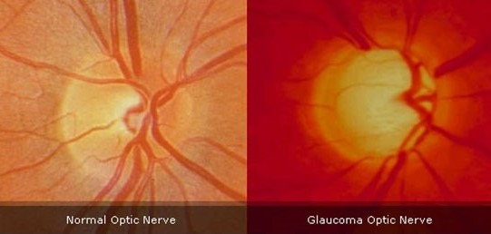

<!--
*** Thanks for checking out the Best-README-Template. If you have a suggestion
*** that would make this better, please fork the repo and create a pull request
*** or simply open an issue with the tag "enhancement".
*** Thanks again! Now go create something AMAZING! :D
-->

<!-- (the "REPO NOT FOUND" message will disappear once you make the repository public) -->
<!-- PROJECT SHIELDS -->
<!--
*** I'm using markdown "reference style" links for readability.
*** Reference links are enclosed in brackets [ ] instead of parentheses ( ).
*** See the bottom of this document for the declaration of the reference variables
*** for contributors-url, forks-url, etc. This is an optional, concise syntax you may use.
*** https://www.markdownguide.org/basic-syntax/#reference-style-links
-->
[![Contributors][contributors-shield]][contributors-url]
[![Forks][forks-shield]][forks-url]
[![Stargazers][stars-shield]][stars-url]
[![MIT License][license-shield]][license-url]
<!-- [![LinkedIn][linkedin-shield]][linkedin-url] -->

<!-- PROJECT LOGO -->
 

  

  <h1 align="center">Deep Learning Based Glaucoma Detection with Cropped Optic Cup andDisc and Blood Vessel Segmentation</h1>

  

<!--     A short report of our experiments. -->
     
    <a target="_blank" href="https://ieeexplore.ieee.org/document/9664528"><strong>READ THE FULL PUBLISHED PAPER AT IEEE ACCESS»</strong></a>
     
    <a target="_blank" href="https://github.com/mirtanvirislam/Deep-Learning-Based-Glaucoma-Detection-with-Cropped-Optic-Cup-and-Disc-and-Blood-Vessel-Segmentation/tree/master/Dataset"><strong>VIEW THE DATASET USED IN THIS PAPER»</strong></a>
     
     
 <!-- <a href="https://github.com/othneildrew/Best-README-Template">View Demo</a>
    ·
    <a href="https://github.com/othneildrew/Best-README-Template/issues">Report Bug</a>
    ·
    <a href="https://github.com/othneildrew/Best-README-Template/issues">Request Feature</a> -->
  

<!-- TABLE OF CONTENTS -->

  
Table of Contents

  <ol>
    <li>
      <a href="#abstract">Abstract</a>
<!--       <ul>
        <li><a href="#software-components">Software Components</a></li>
      </ul> -->
    </li>
    <li><a href="#dataset">Dataset</a></li>
 <ul>
  <li><a href="#dataset-1">Dataset-1</a></li>
  <li><a href="#dataset-2">Dataset-2</a></li>
</ul>
    <li><a href="#data-preprocessing">Data Preprocessing</a></li>
    <li><a href="#methodology">Methodology</a></li>
    <!--<li><a href="#contributing">Contributing</a></li> -->
    <li><a href="#license">License</a></li>
    <li><a href="#supervisors">Supervisors</a></li>
    <li><a href="#contact">Contact</a></li>
    <li><a href="#citation">Citation</a></li>
  </ol>

<!-- ABSTRACT -->
## Abstract

<!-- [![Product Name Screen Shot][product-screenshot]](https://example.com)-->

Glaucoma is an irreversible neurodegenerative disease, where intraocular hypertension is developed due to the increased aqueous humor and blockage of the drainage system between the iris and cornea. As a result, the optic nerve head, which sends visual stimulus from our eyes to the brain, is damaged, causing visual field loss and ultimately blindness. Glaucoma is considered as the sneak thief of vision because it is difficult to diagnose early, and its regular screening is highly recommended to distinguish the neurological disorder. The detection of glaucoma is costly and time-consuming and not only there always remains a good possibility of human error but also this detection method is dependent upon the availability of the resources (experienced ophthalmologists and expensive instruments). In this work, an automatic glaucoma classification technique has been developed by utilizing multiple deep learning approaches. First, a new private dataset of 634 color fundus images has been collected and annotated by two eye specialists, a pediatric ophthalmologist and a glaucoma and refractive surgeon, from Bangladesh Eye Hospital, Bangladesh. Next, various deep learning models (EfficientNet, MobileNet, DenseNet, and GoogLeNet) have been used to detect glaucoma from fundus images. The model with EfficientNet-b3 architecture achieved the best results with test accuracy, F1-score, and ROC AUC of 0.9652, 0.9512, and 0.9574, respectively, for the cropped optic cup and disc fundus photographs. We also constructed a new dataset by segmenting the blood vessels from retinal fundus images employing a U-net model trained on High-Resolution Fundus Image Database. The MobileNet v3 model trained on this dataset achieved a satisfactory test accuracy of 0.8348 and an F1-score of 0.7957. This impressive result suggests that blood vessel segmentation of fundus images can be utilized as an alternative to detect glaucoma automatically.

<!-- ### Software Components

Some of the frameworks and libraries used for this project are listed below:
* [PyTorch](https://pytorch.org/)
* [Pandas](https://pandas.pydata.org/)
* [Seaborn](https://seaborn.pydata.org/) -->

<!-- Dataset -->
## Dataset

A significant contribution of this work is to present unique retinal images from a specialized hospital of all the ocular diseases located in Dhaka, Bangladesh, Bangladesh Eye Hospital (BEH). The color fundus images were taken by a Topcon Retinal Camera TRC-50DX, which is considered the gold standard for retinal imaging. The retinal images were obtained over a timespan of two years, i.e., from 2019 to 2020, and from various Bangladeshi patients aged between 35 to 80. The diagnosis of glaucoma in the optic nerve head (ONH) was performed by two ocular disease professionals, a pediatric ophthalmologist and a glaucoma and refractive surgeon. Finally, the obtained dataset contains 463 normal (nonglaucoma) and 171 glaucoma color fundus images.

Two different models were prepared for this work by in-corporating color fundus samples from Bangladesh Eye Hos-pital (BEH) dataset and the open-source ACRIMA dataset,which consists of 705 ocular fundus photographs. Theinformation of these constructed combined datasets used inthis work has been described in the subsequent paragraphs.

### Dataset-1

Dataset-1 comprises cropped fundus images from the BEH dataset and ACRIMA dataset. The fundus images are cropped to contain the cup and disc portion of the entire color fundus photographs. We used an online tool, "BIRME" to crop the fundus images in large batches. This online tool facilitates us to crop and resize bulk fundus images efficiently. Images were cropped $300 \times 300$ pixels in terms of height and width. The cup and disc are placed in the middle, and the CDR ratio is set to 1:1. Dataset-1 consists of 210 glaucoma samples (69 samples from the BEH dataset and 141 samples from the ACRIMA dataset) and 369 normal samples (319 and 50 samples from the BEH and ACRIMA dataset, respectively).

### Dataset-2

Dataset-2 is an updated version of Dataset-1, constituting cropped and blood vessel segmented fundus images from the BEH dataset and ACRIMA dataset. The fundus images are cropped to contain the cup and disc portion of the fundus image. Dataset-2 comprises 210 glaucoma samples (69 samples from the BEH dataset and 141 samples from ACRIMA dataset) and 369 normal samples (319 samples from BEH and 50 samples from ACRIMA dataset). The samples in Dataset-2 were blood vessel segmented fundus images using a U-net model that was trained on a dataset of High-Resolution Fundus (HRF) Image Database.

## Data Preprocessing

In this research, the datasets were preprocessed with different conventional augmentation techniques. Dataset-1 was preprocessed with various augmentation techniques to increase the dataset size and gain balance and variability in the dataset. Brightness and contrast augmentation is essential as there was a deviation in the saturation, contrast, and color temperature among the fundus images. The dataset contains fundus images from both the left and right eye, which differentiates the orientation of the blood vessel. Random horizontal flip was used to reduce the influence of left/right distinction. Additionally, random rotation was applied to augment the fundus images, so it is less susceptible to the orientation of the cup, disc, and blood vessels.

## Methodology

In this work, two distinct datasets (Datasets 1 and 2) have been created from the cropped optic cup and disc and blood vessel segmented color fundus images of the private BEH and public ACRIMA databases. U-net, the robust CNN architecture, has been utilized to construct the blood vessel segmented dataset. Finally, a wide range of CNN approaches, e.g., MobileNet, EfficientNet, DenseNet, and GoogLeNet, have been used to classify the images into two classes.

The following hyper-parameters were used for training all the models on Datasets - 1 and 2, which have been demonstrated in Table below. For training the models on Datasets - 1 and 2, Adam optimizer with the parameters mentioned above in Table \ref{tab:table5} was used, and cross-entropy loss function was used as the loss function.

  |      Parameter      | Value |
  |:-------------------:|:-----:|
  | Batch size          | 13    |
  | Learning rate       | 0.001 |
  | Learning rate decay | 0.96  |
  | Batch normalization | True  |

In Dataset - 1 and Dataset - 2, the full-size fundus images were cropped to only the cup and disc portion. Initial attempts to train different neural network architectures on full-size fundus images were unsatisfactory. Doing so would result in the model over-fitting to the training dataset and poor accuracy in the test dataset. According to ophthalmologists and other research papers, it is possible to detect whether glaucoma is present from the cup and disc segmentation of the fundus image. Training different neural network architectures on the cropped fundus images proved to be satisfactory in diagnosing glaucoma.

Finally, to validate the efficiency of the proposed system of automatic glaucoma detection, various performance metrics are evaluated, e.g., confusion matrix, validation accuracy graph, precision, recall, F1-score, TPR vs. FPR graph, train/validation/test accuracy, ROC AUC, etc. The mentioned metrics are extensively used to evaluate and assess computer vision and deep learning-based classification problems.

<!-- GETTING STARTED -->

<!-- LICENSE -->
## License

Distributed under the MIT License. See `LICENSE` for more information.

<!-- SUPERVISORS -->
## Supervisors

Dr. Riasat Khan - [Profile](http://ece.northsouth.edu/people/riasat-khan/) - riasat.khan@northsouth.edu

Intisar Tahmid Naheen - [Profile](http://ece.northsouth.edu/people/mr-intisar-tahmid-naheen/) - intisar.naheen@northsouth.edu

<!-- CONTACT -->
## Contact

Mir Tanvir Islam - [Profile](https://www.linkedin.com/in/mirtanvirislam/) - tanvir.islam04@northsouth.edu / mir.tanvir.islam@gmail.com

Shafin T.Mashfu - [Profile](https://www.linkedin.com/in/smashfu/) - shafin.mashfu@northsouth.edu

Sadman Chowdhury Siam - [Profile](https://www.linkedin.com/in/unavailable/) - sadman.siam@northsouth.edu

Abrar Faisal - [Profile](https://www.linkedin.com/in/unavailable/) - abrar.faisal@northsouth.edu

Project Link: [Deep Learning Based Glaucoma Detection with Cropped Optic Cup andDisc and Blood Vessel Segmentation](https://github.com/mirtanvirislam/Deep-Learning-Based-Glaucoma-Detection-with-Cropped-Optic-Cup-and-Disc-and-Blood-Vessel-Segmentation)

<!-- CITATION -->
## Citation
`
M. T. Islam, S. T. Mashfu, A. Faisal, S. C. Siam, I. T. Naheen and R. Khan, "Deep Learning-Based Glaucoma Detection With Cropped Optic Cup and Disc and Blood Vessel Segmentation," in IEEE Access, vol. 10, pp. 2828-2841, 2022, doi: 10.1109/ACCESS.2021.3139160.
`

<!-- ACKNOWLEDGEMENTS -->
<!--## Acknowledgements
* [GitHub Emoji Cheat Sheet](https://www.webpagefx.com/tools/emoji-cheat-sheet)
* [Img Shields](https://shields.io)
* [Choose an Open Source License](https://choosealicense.com)
* [GitHub Pages](https://pages.github.com)
* [Animate.css](https://daneden.github.io/animate.css)
* [Loaders.css](https://connoratherton.com/loaders)
* [Slick Carousel](https://kenwheeler.github.io/slick)
* [Smooth Scroll](https://github.com/cferdinandi/smooth-scroll)
* [Sticky Kit](http://leafo.net/sticky-kit)
* [JVectorMap](http://jvectormap.com)
* [Font Awesome](https://fontawesome.com) -->

<!-- MARKDOWN LINKS & IMAGES -->
<!-- https://www.markdownguide.org/basic-syntax/#reference-style-links -->
[contributors-shield]: https://img.shields.io/github/contributors/mirtanvirislam/Glaucoma-Detection-with-ML-NN.svg?style=for-the-badge
[contributors-url]: https://github.com/mirtanvirislam/Glaucoma-Detection-with-ML-NN/graphs/contributors
[forks-shield]: https://img.shields.io/github/forks/mirtanvirislam/Glaucoma-Detection-with-ML-NNe.svg?style=for-the-badge
[forks-url]: https://github.com/mirtanvirislam/Glaucoma-Detection-with-ML-NN/network/members
[stars-shield]: https://img.shields.io/github/stars/mirtanvirislam/Glaucoma-Detection-with-ML-NN.svg?style=for-the-badge
[stars-url]: https://github.com/mirtanvirislam/Glaucoma-Detection-with-ML-NN/stargazers
[issues-shield]: https://img.shields.io/github/issues/mirtanvirislam/Glaucoma-Detection-with-ML-NN.svg?style=for-the-badge
[issues-url]: https://github.com/mirtanvirislam/Glaucoma-Detection-with-ML-NN/issues
[license-shield]: https://img.shields.io/github/license/mirtanvirislam/Glaucoma-Detection-with-ML-NN.svg?style=for-the-badge
[license-url]: https://github.com/mirtanvirislam/Glaucoma-Detection-with-ML-NN/blob/master/LICENSE.txt
[linkedin-shield]: https://img.shields.io/badge/-LinkedIn-black.svg?style=for-the-badge&logo=linkedin&colorB=555
[linkedin-url]: https://linkedin.com/in/mir-tanvir-islam/
[product-screenshot]: images/screenshot.png
